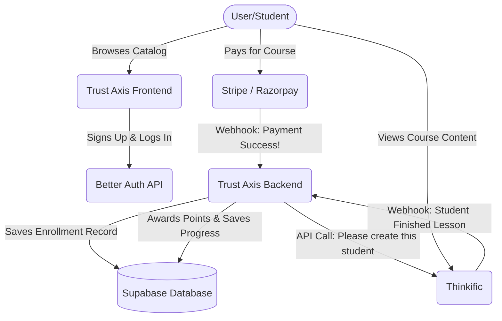

# Trust Axis Platform: System Architecture & Ecosystem Guide

Welcome to the Trust Axis ecosystem documentation! This document provides a complete, beginner-friendly breakdown of how the entire Trust Axis platform operates. It is designed for both technical developers and non-technical stakeholders to understand the structure, data flow, and technologies powering the system.

---

## 1. High-Level Overview

Trust Axis is a comprehensive, hybrid platform dedicated to online education (Learning Management System - LMS) and professional consultancy services. Operating mostly in cybersecurity, AI, fintech, and digital transformation, the platform acts as a digital campus and consulting agency combined into one.

The system features a centralized user identity to securely handle trainers, students, and admins. It provides visually stunning storefronts for courses and consulting, paired with a robust administrative backend to track payments, enrollments, and user engagement. While Trust Axis handles all the user accounts, payments, and storefront presentation, the actual heavy-lifting of online class delivery (hosting videos, quizzes, etc.) is seamlessly handed off to an external partner platform (Thinkific). 

---

## 2. Detailed Breakdown of System Parts

We can break down Trust Axis into three distinct layers: the User Interface (what the user sees), the Business Logic (the brain), and the Data Layer (the memory).

### 2.1. The User Interface (Frontend Layer)
The frontend consists of two main websites bundled together as a monorepo (multiple apps in one repository):
- **Marketing & Landing Site (`/frontend`):** This is the "front door" of the business. It contains the main landing pages, details about the consultancy services, the team, resources (blogs, articles), and the registration/login portals.
- **Courses LMS Site (`/courses-page`):** A dedicated subdomain or portal specifically focused on displaying the course catalog, filtering courses, and viewing detailed syllabuses. 

**Folder Structure Context:**
- `package.json` (root): Manages the entire monorepo, keeping all independent apps unified.
- `dev.sh`: A core script managing both local development and production environment startup securely.
- `/frontend/src`: Contains all React components, page layouts, and UI tokens for the main public-facing site.
- `/courses-page/src`: Holds the specific logic isolated for course browsing, preventing it from slowing down the main marketing site.
- `/api-security`: A small toolkit holding scripts to manually test the security endpoints against hacking vulnerabilities.

### 2.2. The Business Logic (Backend / APIs)
The "brain" of the operation lives within the same Next.js infrastructure as the frontend, utilizing modern "Server Actions" and "API Routes". 
- **Authentication Services:** Securely logs users in, signs them out, and manages their session cookies (powered by Better Auth).
- **Checkout & Payment Handlers:** Communicates with payment processors when a user buys a course or books a consulting session.
- **Sync Services (LMS Webhooks):** Secret endpoints that constantly listen for updates from the classroom system (Thinkific) to update a student's progress and issue reward points on our platform.
- **Admin Tools:** Secure portals for staff to approve trainers, update course catalogs, and moderate users.

### 2.3. The Data Layer (Database)
The source of truth. Every user account, payment history, consulting booking, and reward point is securely saved in a cloud database. 
- **Database Tech:** PostgreSQL, hosted on Supabase, and accessed securely via Prisma (a tool that simplifies database communication).

---

## 3. Technology Stack Summary

Here are the specific tools and programming languages we use to build and run Trust Axis:

*   **Programming Languages:** TypeScript, JavaScript (Node.js) - providing strict rules to prevent bugs.
*   **Web Framework:** Next.js (versions 14 & 16) - powers both the frontend visuals and the backend APIs simultaneously using the App Router.
*   **User Interface Tools:** React 19, Tailwind CSS (for styling), Base UI, and Lucide React (for icons) to create modern, dynamic, and beautiful screen designs.
*   **Database:** PostgreSQL hosted by Supabase.
*   **Database Tool (ORM):** Prisma Client - allows our code to talk to the database easily.
*   **Authentication Engine:** Better Auth - handles all session management securely.

---

## 4. Connection Map: How the Pieces Talk

Here is a simple flow of how data moves around when a user buys and takes a course.

1. **Browsing:** A user looks at a course on the `frontend` or `courses-page`.
2. **Payment:** When purchased, learning payment portals interact with payment gateways.
3. **Database Saving:** The Trust Axis backend records "John Doe bought Course X" in the internal database.
4. **LMS Sync:** The Trust Axis backend instantly sends a message to Thinkific saying "Let John Doe watch the videos for Course X."
5. **Classroom Syncing:** As John Doe watches videos on Thinkific, Thinkific sends silent messages back to Trust Axis saying "John Doe finished Video 1!", which updates John's progress bar on our main site.

---

## 5. Database Analysis

Our database serves as a gigantic, highly-organized filing cabinet. It uses a **Relational SQL Database (PostgreSQL)**, meaning all tables are strictly structured and connected (related) to each other.

### The Filing Cabinet Structure (Tables)
*   **`users`:** The master list of everyone. Tracks if someone is an admin, a trainer, or a student, along with their reward points.
*   **`trainers`:** Extra details just for teachers, like their biography, Linkedin URL, and years of experience.
*   **`courses`:** The metadata (title, price, description) of the classes we sell. (Actual videos are not stored here).
*   **`enrollments`:** A combination or "receipt" connecting a User to a Course. It tracks their progress (e.g., 50% completed).
*   **`payments`:** The financial ledger recording every successful or failed purchase.
*   **`consultancy_offerings` & `consultancy_bookings`:** Stores what consulting services a trainer offers, and handles the calendar bookings when a user schedules a session with them.
*   **`rewards_events`:** A detailed log of every time a user earned points (e.g., "Earned 50 pts for signup," "Earned 100 pts for finishing a lesson").

---

## 6. Integrations and Plugins

No modern app operates alone. We plug into several external powerful tools:

*   **Better Auth:** 
    *   *What it does:* The bouncer at the door. It handles passwords, session cookies, and ensures users are who they say they are across both our websites.
*   **Supabase (and Postgres):** 
    *   *What it does:* The giant digital hard drive and database where we store all our records.
*   **Thinkific:** 
    *   *What it does:* The physical classroom. Because hosting hundreds of gigabytes of heavy 4K videos and interactive quizzes is difficult, Thinkific is basically an outsourced campus that we securely bridge our users into.
*   **Stripe / Razorpay:** 
    *   *What it does:* The cash register. They handle credit cards securely so we don't have to touch sensitive banking data.
*   **Prisma:** 
    *   *What it does:* A translator. It allows our TypeScript code to speak beautifully to our PostgreSQL database without writing raw, complex database queries by hand.

---

## 7. How This System Works in Plain English

Imagine Trust Axis as an elite, real-world University combined with a premium Consulting Firm.

We have a massive **main reception building (Our Frontend Websites)**. Anyone from the street can walk in, browse the beautiful catalogs detailing what classes we offer, or read up on the consulting services our professors provide.

When a student decides to take a class, they can't just walk into a room. They have to get an **ID Card**. They go to the reception desk, fill out their details, and create their ID Card **(Better Auth)**. 

To take a class, they go to the cashier **(Stripe/Razorpay)**. Once they pay, the cashier updates the **main university record book (Supabase Database)** to say, *"Jane Doe is officially enrolled in Cybersecurity 101."*

Here's the trick: The actual classrooms aren't in our reception building. They are in a secure **satellite building dedicated only to teaching (Thinkific)**. 
So, our receptionist picks up a radio and calls the satellite building, saying: *"We just signed up Jane Doe. Give her the keys to room 101."* 

Jane now walks over to the satellite building (Thinkific) to sit down, watch her lectures, and take her tests. But the university still wants to know how she's doing! So, every time Jane watches a full video or aces a test, the teacher in that room radios the main building back **(Webhooks)** to report her progress. The main building logs this down, awards her some bonus reward points, and displays a little "90% complete" badge on her profile the next time she visits the reception building. 

Every piece of the platform has a very specific job, allowing thousands of students and trainers to learn, teach, and transact simultaneously without missing a beat!
